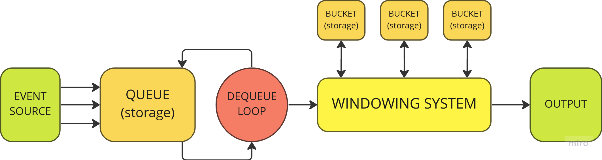

# WinRx - A Windowing System for RXJS

By introducing new operators, **WinRx** allows you to extend RXJS' windowing
capablities to make it able to process windows of data from a stream in a more
customized way.

### Architecture

In order to prevent data races, all events are stored into a **queue** as soon
as they are ingested. A **loop** keeps dequeueing them so that they can be actually
processed one by one by the **windowing system**. The windowing systems handles the
assignment of each event to a specific **bucket**, basing on event timestamp (event
time or processing time) and key. It also decides when to open a new bucket, or
close an existing one to release a **window of events**.

<br>



<br>

### Supported Window Types

- [Tumbling Window](#tumbling-window)
- [Session Window](#session-window)
- [Hopping Window](#hopping-window)
- [Snapshot Window](#snapshot-window)
- [Counting Window](#counting-window)

### Supported Storage Types

- [Memory](#memory)
- [Redis](#redis)

<!-- ## General behaviour

- Every window operator receives single **T** value and outputs a **T[]** value
  each time a window gets closed.
- Whenever an _error_ or _complete_ event is triggered, active windows gets
  forcibly closed, unless the **closeOnError** and **closeOnComplete** options
  are set to false (true if omitted). In this case all values that are not
  included in an already closed window will be lost.
- In case of an **error** event, the value is still passed as an array of length
  1 to keep consistency with next events. -->

## Features

### Use Event Time instead of Processng Time

### Split Windows with Event Key

Events streamed throught the same observable can be split into multiple
separated "windowing pipelines" by providing a callback to extract a key from
the event itself (otherwise all events come with the "default" key). In this
way, events with different keys will be treated as separated streams flowing
through the same pipeline.

```typescript
const events = [{
  key: 1,
  value: "hola",
}, {
  key: 1,
  value: "todo",
}, {
  key: 2,
  value: "hello",
}, {
  key: 1,
  value: "mundo",
}, {
  key: 2,
  value: "world",
}];

from(events).pipe(
  tumblingWindow({
    size: 100,
    withEventKey: (e: any) => e.key,
  }),
).subscribe((window: any[]) =>
  console.log(
    window
      .map((event) => event.value)
      .join(" "),
  )
);

/**
 * output:
 * hola todo mundo
 * hello world
 */
```

## Window Types

### Tumbling Window

### Session Window

### Hopping Window

### Snapshot Window

### Counting Window

## Storage Types

### Memory

### Redis
